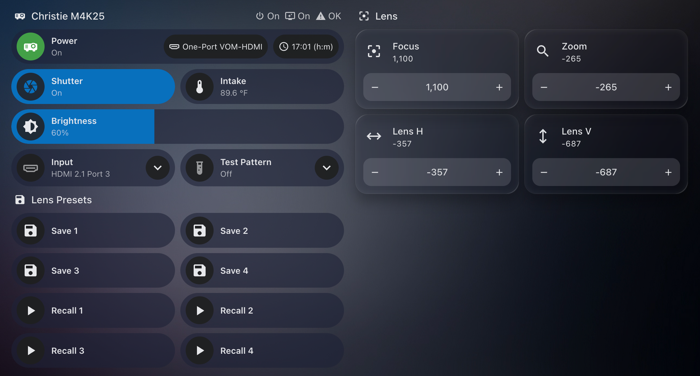

# christie-m4k25-homeassistant

A native Home Assistant integration for a Christie M 4K25 RGB projector,
built on [`py-christie-mseries`](https://github.com/imsatasia/py-christie-mseries),
the standalone Python client for the projector's serial API over TCP 3002
(this projector does not implement PJLink).

## Contents

- [Install](#install)
- [Entities](#entities)
- [Services](#services)
- [Example dashboard](#example-dashboard)
- [Why lens control lives here but didn't in the old setup](#why-lens-control-lives-here-but-didnt-in-the-old-setup)
- [Design notes](#design-notes)
- [Testing](#testing)
- [Layout](#layout)

## Install

Add this repository to [HACS](https://hacs.xyz/) as a custom repository, or
copy `custom_components/christie_m4k25/` into your Home Assistant
`config/custom_components/` directory and restart. Then add the integration
from **Settings → Devices & Services → Add Integration → Christie M 4K25
RGB** and enter the projector's IP (it should have a DHCP reservation).

## Entities

| Entity | Platform | Notes |
|---|---|---|
| Power | `switch` | `PWR 1`/`PWR 0`. UI refreshes ~20s after a command since the projector answers nothing for the first few seconds of warm-up/cooldown. |
| Shutter | `switch` | Mechanical shutter (douser). |
| Brightness | `number` | Laser power, 30–100%. See `py-christie-mseries`'s README for why 30% rather than the projector's own 20% floor. |
| Lens Focus / Zoom / Horizontal / Vertical | `number` | Absolute motor positions. No published range — see below. Disabled by default; enable the ones you use. |
| Input | `select` | Lists the projector's physical ports by label ("HDMI 2.1 Port 3", "DisplayPort 1.4 Port 4", ...), not its own `One-Port VOM-HDMI` names or an index. The labels come from `py-christie-mseries`' `INPUTS` table, so they match the CLI. Unavailable while the projector is in standby, which refuses input changes. An input the library has no label for is shown under the projector's own name but can't be chosen. |
| Test Pattern | `select` | Options and labels come straight from the library, so there's one source of truth for the list. Rejected (entity goes unavailable) while the projector is in standby. |
| Status | `sensor` | The projector's own power wording, e.g. "On", "Standby Mode", "Warming Up". |
| Input | `sensor` | Current input, as the projector's own name (e.g. `One-Port VOM-HDMI`). |
| Hours | `sensor` | Text, not numeric — the projector reports it as `"3:14 (h:m)"`. |
| Intake Temperature | `sensor` | °C, `measurement` state class. |
| LiteLOC | `binary_sensor` | Read-only — this unit reports it `enabled: false` in its own menu. |
| Alarm | `binary_sensor` | `problem` device class; on when the alarm count is nonzero. |

All entities are backed by one 30-second poll (`ChristieM4K25.snapshot()`),
the same one-connection-per-cycle design the CLI and the old YAML-based
setup used, because each reading costs a TCP round trip.

## Services

Lens position and test pattern each have a dedicated entity, but a few
things don't map cleanly onto a single entity:

- **`christie_m4k25.save_lens_preset`** / **`recall_lens_preset`** — the
  projector has no lens memory of its own (see `py-christie-mseries`'s "No
  ILS / lens memory"), so this integration synthesises four preset slots the
  same way the [Control4 driver](https://github.com/imsatasia/christie-m4k25-control4)
  does: save persists the four current motor positions, recall replays them
  as absolute moves. Recall is refused while the projector is in standby,
  same as any other lens move.
- **`christie_m4k25.send_raw`** — escape hatch for any code not wrapped by
  an entity, e.g. `GAM?` to read or `SHU 1` to write. Subcodes work too:
  `LAS+POWR?`.

## Example dashboard

A [Bubble Card](https://github.com/Clooos/Bubble-Card) view exercising every
entity and service this integration exposes — power/shutter, brightness,
input and test pattern selects, all four lens positions, and the eight
save/recall preset buttons:



Full YAML for this view: [`docs/example-dashboard.yaml`](docs/example-dashboard.yaml).
Drop it under `views:` in a `mode: yaml` dashboard and replace the
`192_0_2_50` placeholder with your own projector's IP (dots as
underscores) — check **Settings → Devices & Services → Christie M 4K25
RGB** for your exact entity IDs.

## Why lens control lives here but didn't in the old setup

The command_line/shell_command/template YAML package this integration
replaces only ever covered the 10 entities above minus the four lens
numbers and the two lens-preset services — lens control existed only in the
Control4 driver. This integration brings Home Assistant to parity with that
driver, using `homeassistant.helpers.storage.Store` as the natural
Home-Assistant-native equivalent of the driver's `C4:PersistSetValue`.

## Design notes

- **The client stays synchronous.** `py-christie-mseries` is a simple
  request/response client over plain blocking sockets, by design — see its
  `AGENTS.md`. Every call here goes through
  `hass.async_add_executor_job()`, and both the coordinator and every
  command open their own short-lived connection per call rather than
  holding one open across Home Assistant's lifecycle.
- **A poll failure is `UpdateFailed`, not a sentinel field.** The old YAML
  setup reported `{"available": false}` from `command_line`'s JSON as its
  own way of telling "can't read it" apart from "it's off" (important right
  after a power command, when the projector accepts the TCP connection but
  answers nothing for a few seconds). `DataUpdateCoordinator` already gives
  every entity that distinction for free via `last_update_success` /
  `CoordinatorEntity.available`, so this integration just raises
  `UpdateFailed` on any read error and lets the framework handle it.
- **Protocol semantics stay out of this repo.** Brightness floor, test
  pattern names, the lens axis mapping, reply parsing — all of it lives in
  `py-christie-mseries`. This repo is a thin projection on top, matching how
  `trinnov-altitude-homeassistant` is built relative to `py-trinnov-altitude`.

## Testing

```bash
make install   # syncs deps and installs ../py-christie-mseries as editable
make check     # lint + format-check + typecheck + test
```

`CHRISTIE_LIB_PATH` (default `../py-christie-mseries`) points dev/test at a
sibling checkout of the library rather than a published release, the same
convention `trinnov-altitude-homeassistant` uses for `py-trinnov-altitude`.

## Layout

| Path | Purpose |
|------|---------|
| `custom_components/christie_m4k25/coordinator.py` | Polls `ChristieM4K25.snapshot()` every 30s |
| `custom_components/christie_m4k25/commands.py` | Runs write commands, each its own short connection |
| `custom_components/christie_m4k25/config_flow.py` | UI setup: host/port with a connection probe |
| `custom_components/christie_m4k25/services.py` | `save_lens_preset` / `recall_lens_preset` / `send_raw` |
| `custom_components/christie_m4k25/{switch,number,select,sensor,binary_sensor}.py` | Entity platforms |
| `tests/` | pytest + `pytest-homeassistant-custom-component`, one file per platform |
